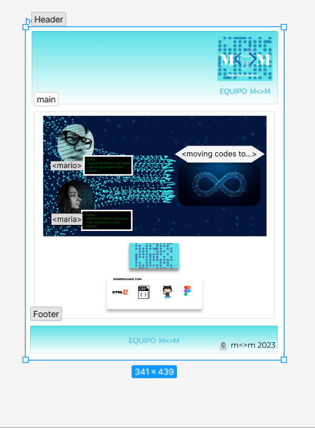
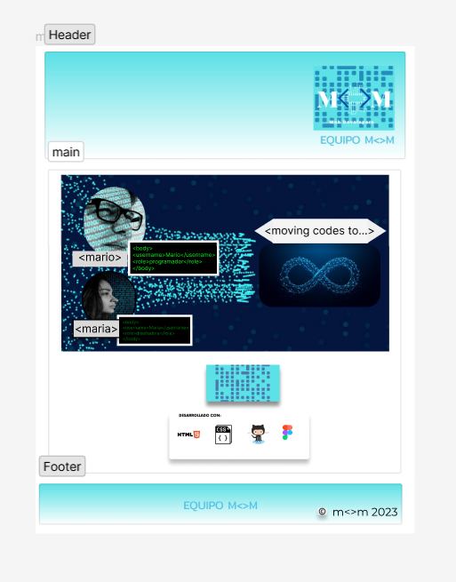
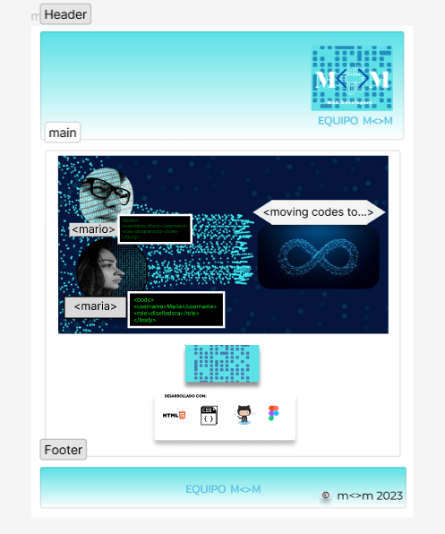

# team_m-m

# Proyecto Web estática:  M<>M Web Developers

## DESCRIPCIÓN Y OBJETO DEL EJERCICIO

El proyecto-ejercicio consiste en una la realización de una página web estática con los siguientes requisitos:

- Un encabezado con el nombre del equipo
- Un logotipo
- Un banner
- Debe tener un slogan
- Una foto/avatar/imagen representativa de cada miembro
- Cuando el mouse pase encima del avatar este deberá cambiar
- El nombre de cada integrante (no hace falta el apellido)
- Junto a la foto, una palabra que defina el integrante del equipo
- Un sección de las herramientas utilizadas por el equipo
- Un pie de página con el símbolo de copyright y el nombre del equipo

## CONTENIDOS

1. Home y secciones
2. Prototipo
3. Tecnologías
4. Acceso a Git Pages
5. Instalación
6. Autores

## HOME Y SECCIONES

###### Página principal

###### Página 2

###### Página 3

## PROTOTIPO

## TECNOLOGÍAS
	 Git Hub
	 Visual Studio Code
	 Figma
	 HTML5
	 CSS3

## ACCESO A GIT PAGES

## INSTALACIÓN

## AUTORES

- Mario Olabe (https://github.com/cyber-aurora)
- María V. Besada Vidal  (https://github.com/Maria-VBV)
